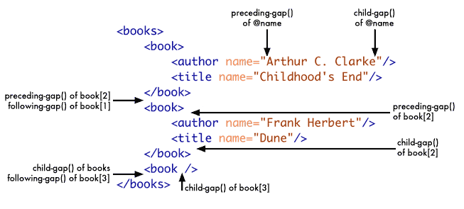

##What is NView, and why use it?
* Natural Views, which are a means of being able to separate php from html completely. There are several key advantages that this offers:
 * More readable code / design.
 * Separation of concerns - the designer can modify the markup at any time.
 * Non-linear code. Rather than having to process the document in the order that it is rendered, it can be processed according to business-sense.
 * One develops much cleaner markup!

##Copyright
* Copyright ©2013-2014 Red Snapper Ltd. All rights reserved.

##License
GNU/GPLv2
http://www.gnu.org/licenses/gpl-2.0.html

###Example
The repository includes an example in the hw folder.
You should be able to put that into any php-enabled web service.
Then use the url ../hw/hw.php  

###Using Natural Views.
Natural views are a means of being able to separate php from html completely.
The mechanism used to do this is via xpaths. 

To try using the Natural Views, separate the view part of the code, and put it into it's own file, using the xml suffix. It must be valid XHTML 5.
In the php, one will need to include the nview.iphp library

````
require_once("nview.iphp");
````

Then one will need to instantiate the view object, by invoking it with:

````
$nv=new NView(); //This will work if the xml file has the same basename as the php file.
````

One can also instantiate an NView with other files (by using the filename)
````$nv=new NView('specific.xml');````

or an existing DOMDocument, DOMElement, or even a (valid) string of xhtml.
````
$nv=new NView('<html>...</html>');
````

One can also use clone to copy NViews.
````
$ni=clone $nv;```` or ````$ni=new NView($nv);
````

NView has three primary functions: get(),set() and show()

In general, when using xpaths with NView, it is important to know that the prefix h: is always tied to the namespace http://www.w3.org/1999/xhtml
Other namespaces may be added to an NView, by using the function..
addNamespace($prefix,$namespace);

####set($xpath,$value = null,$ref = null)
eg. the following sets the class of all odd li elements to 'odd'.
````
$nv->set('//h:li[position() mod 2 = 1]/@class','odd');
````

####get($xpath, $ref = null)
This function will return either a DOMNodeList (if there is more than one result), or it will return the object itself (if there is just one result).

eg. the following returns the class of the first li element in the document.
````
$class = $nv->get('(//h:li)[1]/@class');
````

One may use a returned element as a reference for a subsequent get or set.
E.g:

```
//each data-next-class will hold the class of the following li.
$llist=$nv->get('//h:ul[@class='main']/h:li');
if ($llist instanceof DOMNodeList)
{
	$next = null;
	for( $pos=$llist->length - 1; $pos >= 0 ; $pos-- )
	{
		$ref = $llist->item($pos);
		if (!is_null($next))
		{
			$nv->set('./@data-next-class',$next,$ref);
		}
		$next = $nv->get('./@class',$ref);
	}
}
```

####Other functions
consume() is syntactic sugar. It deletes the addressed node(s) from the source document. It is very useful for grabbing an li as an item template.
It is functionally equivalent to:
```
$a=$nv->get($xpath,$ref); 	//get the result
$nv->set($xpath,null,$ref); //delete from source
```

####show($asdocument = false);
show() returns the view as a string, with the option of including the namespace, doctype and xml prolog (which by default it will not).

```
$xv= new NView('<!DOCTYPE head><head><title>title</title></head>');
$xv->set('//h:title/text()','Hello World');
$xv->show(false);

==> '<head><title>Hello World</title></head>'
```

####Natural Views extend xpath with gaps!!
The gap is probably the most significantly useful aspect of Natural. It allows for the coder to insert nodes - something that xpath itelf cannot do (as there is no ability with XPath to address gaps or insertion points). There are ways of doing this using DOM functions, but the point of this library is to make the view accessible without having to learn the DOM api.

There are three gap extensions: child-gap(), preceding-gap(), following-gap().

The easiest way to see how they differ is to examine the following image


